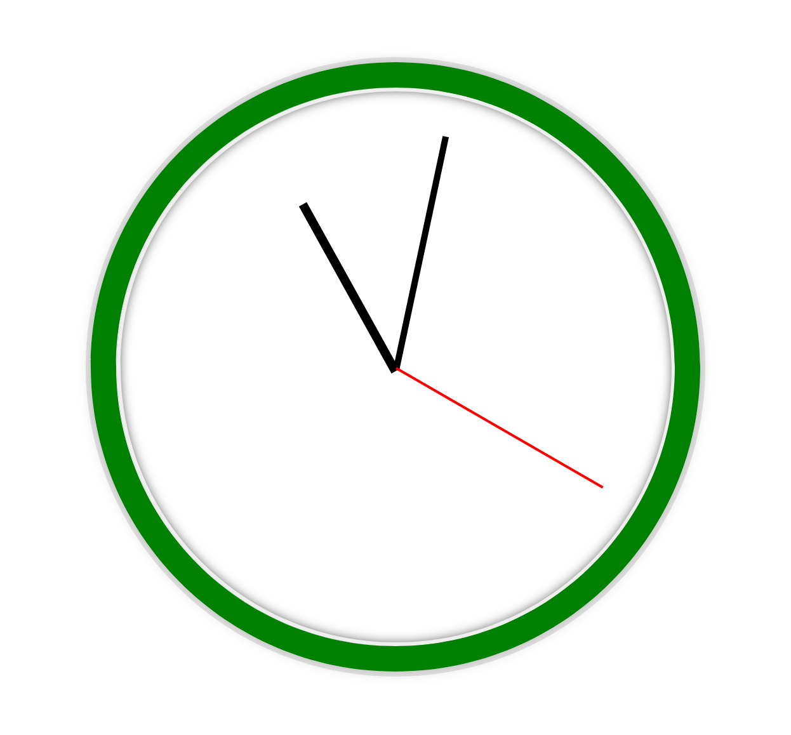

# JS Clock

An web application that display analog clock

## 🛠 Skills

Javascript, HTML, CSS...

## Screenshots

## Demo

Demo Link: [https://thepran.github.io/JS-clock/](https://thepran.github.io/JS-clock/)

## Feedback

If you have any feedback, please reach out to us at negipranaysingh@gmail.com
